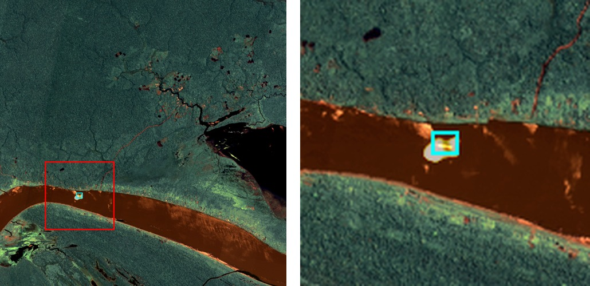
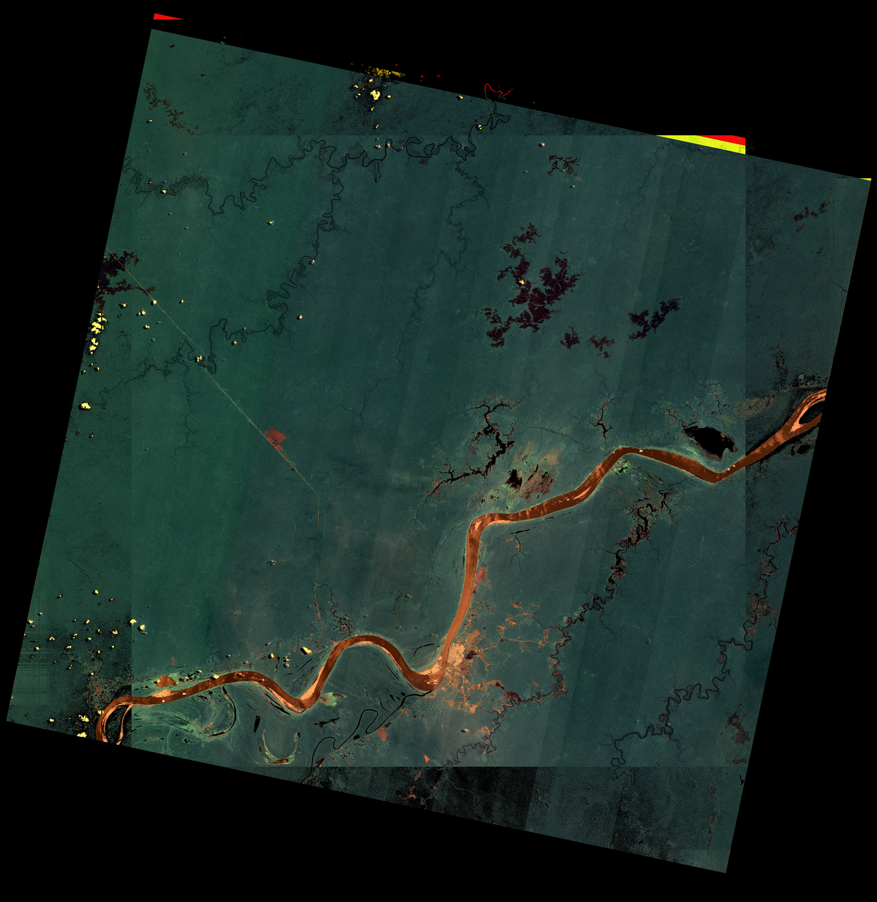

# Garimpo Detection from CBERS-4A Imagery

## Overview

This repository implements an automated, learning-based detector for *garimpo* (illegal
gold-mining) barges and dredges on the médio Rio Madeira, built from CBERS-4A optical
satellite imagery. It extends the manual-digitizing methodology introduced by
**Monteiro (2024)** into a supervised segmentation pipeline: a U-Net predicts a per-pixel
garimpo probability heatmap on 512×512 tiles, and a sliding-window inference stage stitches
that prediction across full scenes for scene-level detection. This is a **research
internship project** (EMINES School of Industrial Management, Université Mohammed VI
Polytechnique × Universidade Federal do Amazonas, DEGEO), not a finished or
deployment-ready product — see [Known Limitations](#known-limitations) below.

## Key Results

Aggregated across all 13 available CBERS-4A scenes (2 footprints, 34 confirmed unique
garimpo sites after merging duplicate corner labels), at a probability threshold of 0.5:

- **100% recall** — every one of the 34 known sites is detected, with zero false negatives.
- **30.4% raw precision** (34 TP / 112 detected blobs), rising to **43.6%** once
  false positives sitting on documented mosaic-seam/nodata artifacts are excluded.
- Evaluated over **13 scenes** spanning 2020–2023, covering **34 confirmed sites**.

<p align="center">
  
</p>

<p align="center">
  
</p>

Full methodology, per-scene breakdowns, and the false-positive root-cause analysis behind
these numbers are in the [reports](#reports).

## Project Structure

```
Garimpo/
├── src/garimpo/                  # Installable Python package
│   ├── masks.py                  # Rasterize bounding boxes into per-tile binary masks
│   ├── splits.py                 # Scene-grouped dev train/val split (no tile-level leakage)
│   ├── datasets.py               # PyTorch Dataset pairing tiles and masks by filename
│   ├── augmentation.py           # Joint image+mask augmentation for training
│   ├── model.py                  # U-Net (ResNet18 encoder) model factory
│   ├── losses.py                 # Weighted BCE + Dice loss, data-derived pos_weight
│   ├── train.py                  # Training loop, checkpointing, early stopping
│   ├── visualize.py               # Predicted-probability heatmaps on held-out val tiles
│   ├── infer_scene.py            # Sliding-window inference over a full-size scene
│   ├── scan_scene.py             # Blob detection over a stitched probability map
│   ├── evaluate_detections.py    # Match blobs vs. ground truth -> TP/FP/FN, precision/recall
│   ├── audit_artifacts.py        # Diagnostic: are positive labels near scan artifacts?
│   ├── colorize_heatmap.py       # Probability maps -> RGBA overlays + web viewer manifest
│   └── export_blob_markers.py    # Per-threshold blob markers for the web viewer's slider
├── scripts/                      # Standalone, self-contained scripts (no repo imports)
│   ├── verify_composicao_standalone.py                    # Kaggle: RGB-compositing accuracy check
│   └── verify_composicao_detection_robustness_standalone.py  # Kaggle: detection robustness to re-compositing
├── web_viewer/                   # Static Leaflet map viewer (no build step, no backend)
│   ├── index.html                # Map UI: scene picker, opacity slider, per-detection markers
│   ├── manifest.json / manifest.js   # Scene metadata (date, footprint, heatmap file)
│   ├── blobs.js                  # Precomputed per-threshold detection markers
│   └── heatmaps/                 # Per-scene RGBA heatmap overlays (PNG)
├── docs/
│   ├── dataset_limitations.md    # Label-quality audit: mosaic-seam proximity, duplicate boxes
│   ├── images/                   # Result figures embedded in this README
│   └── reports/                  # Full written reports (see Reports below)
├── data/                         # Gitignored: raw scenes, tiles, masks, bboxes.csv, labels.csv
├── runs/                         # Gitignored: training run outputs (checkpoints, metrics.csv)
├── pyproject.toml                # Package metadata and dependencies
└── .gitignore
```

`data/` and `runs/` are not tracked in git (too large, and reproducible from scripts) —
they must be populated locally before running the pipeline. `scene_cache/` and
`downloads/` are also gitignored as reserved locations for any locally cached/downloaded
scene imagery, should a future fetch step write there.

## Setup / Installation

Requires Python >= 3.10.

```bash
pip install -e .
```

This installs the `garimpo` package along with its dependencies (numpy, pandas, pillow,
scipy, tqdm, torch, torchvision, segmentation-models-pytorch), declared in
`pyproject.toml`.

No environment variables are currently required — nothing in the pipeline reads from a
`.env` file or an API key at this stage.

**CPU vs. GPU:** training is only practical on CPU for a very short smoke test (the
`epochs=2` run in this project's history). The canonical 20-epoch runs were trained on a
Google Colab GPU runtime; expect training on CPU alone to be too slow for a full run.

## Usage

All commands assume `pip install -e .` has been run and `data/` is populated. Each stage
below is a `python -m` entry point with `argparse` defaults matching the paths shown; run
with `--help` for the full option list.

**1. Rasterize masks from labeled bounding boxes:**
```bash
python -m garimpo.masks --tiles-dir data/tiles --bboxes-csv data/bboxes.csv \
  --labels-csv data/labels.csv --masks-dir data/masks
```

**2. Check the scene-grouped train/val split:**
```bash
python -m garimpo.splits --labels-csv data/labels.csv --val-fraction 0.2
```

**3. Train the model:**
```bash
python -m garimpo.train --epochs 20 --batch-size 8 --lr 1e-4
```
Writes checkpoints and `metrics.csv` to a new timestamped directory under `runs/`.

**4. Run sliding-window inference on a full scene:**
```bash
python -m garimpo.infer_scene \
  --input-image data/raw/<scene>.png \
  --checkpoint runs/<run_dir>/best.pt \
  --output-path runs/<run_dir>/scene_inference/<scene>_heat.png
```
Also writes `<scene>_heat_prob.png`, the raw per-pixel probability map used by the next step.

**5. Scan the probability map for detections:**
```bash
python -m garimpo.scan_scene \
  --prob-image runs/<run_dir>/scene_inference/<scene>_heat_prob.png \
  --scene-image data/raw/<scene>.png
```

**6. Evaluate detections against ground truth (precision/recall):**
```bash
python -m garimpo.evaluate_detections
```
Defaults to `runs/runs_v3/scene_inference/` and `data/`; override with
`--scene-inference-dir`, `--raw-dir`, etc. for a different run.

**Map viewer:** open `web_viewer/index.html` directly in a browser — it's static
(Leaflet + local JS/JSON, no build step or server required).

**Live backend:** a served API/backend for the viewer is planned but not yet implemented
in this repository.

## Known Limitations

Full detail, methodology, and evidence for each of these live in
[`docs/dataset_limitations.md`](docs/dataset_limitations.md):

- **Approximate georeferencing** in the web viewer — each scene is placed using a single
  per-footprint bounding box from one date's metadata, reused across all other dates on
  that footprint (CBERS-4A track stability is ~±5km pass-to-pass).
- **Footprint/scene leakage** between train and val — the dataset covers only 2 distinct
  footprints, so the dev-train/dev-val split cannot be a fully independent held-out test;
  it's a development split for model selection, not an unbiased final estimate.
- **Compositing-script verification status** — whether `composicao_cbers4a_wpm.py`
  reproduces the exact RGB composites the model was trained on is checked by the
  standalone scripts in `scripts/`, run separately in a Kaggle notebook; it is not
  verified automatically as part of this repository's pipeline.
- **Train/val overfitting gap** — by the final epoch of the canonical run, train Dice
  reaches 0.869 while val Dice sits at 0.523, a wide and still-widening gap.

## Reports

- [`docs/reports/garimpo_progress_report.pdf`](docs/reports/garimpo_progress_report.pdf)
  (LaTeX source: [`garimpo_progress_report.tex`](docs/reports/garimpo_progress_report.tex)) —
  Progress Report II: project background, dataset re-audit, model/training configuration,
  and the full-scene evaluation and false-positive analysis behind the headline numbers above.
- [`docs/reports/pipeline_report.pdf`](docs/reports/pipeline_report.pdf) — a pipeline and
  methodology report generated directly from this repository's own data files and scripts
  (dataset summary, training curves, per-scene precision/recall, and a root-cause
  reconciliation of all false positives).

## Acknowledgements

This project builds directly on the manual-digitizing methodology of **Monteiro (2024)**.
It was carried out under the supervision of **Naziano Filizola** (DEGEO, Universidade
Federal do Amazonas), as a joint research internship between **EMINES School of
Industrial Management (Université Mohammed VI Polytechnique)** and **UFAM**.
